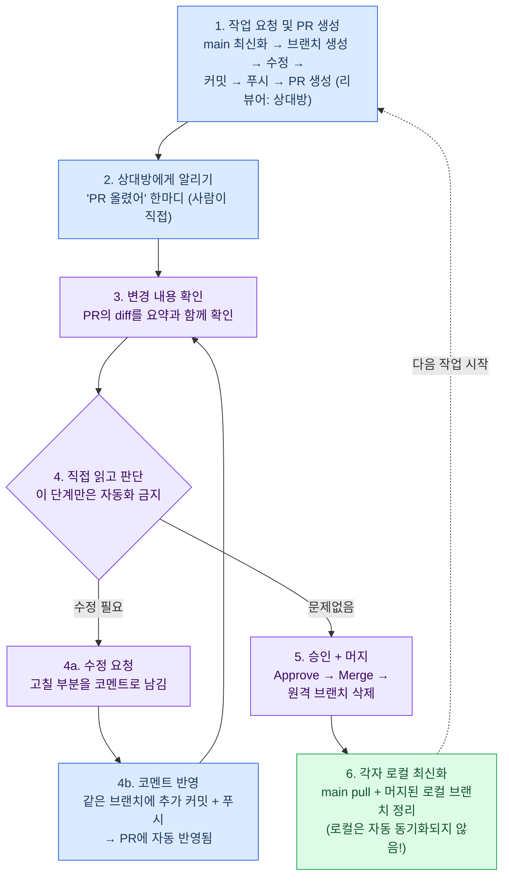

# 협업 규칙 (필독 — 클론 직후, 첫 커밋 전에 끝까지 읽을 것)

> 이 문서는 "권장 사항"이 아니라 **팀의 약속**입니다.
> 2인 협업에서 git 이력이 한 번 꼬이면 복구에 반나절이 날아가고, 데이터가 한 번 유출되면 복구 자체가 불가능합니다.
> 아래 🚨 절대 금지 항목은 **어떤 경우에도 예외가 없습니다.**

---

## 🚨 절대 금지 5계명

### 1. `main`에 직접 커밋/푸시 절대 금지

- 모든 변경은 **브랜치 → PR → 상대방 승인 → 머지**. 오타 한 글자 수정도 예외 없음.
- "금방 끝나는 거니까 그냥 main에 하자"가 이력이 꼬이는 첫 번째 원인입니다.
- 브랜치 보호 규칙이 막아주지만, 관리자는 우회가 가능하므로 **스스로 지켜야 합니다.**

### 2. `git push -f` (force push) 절대 금지

- force push는 **상대방이 이미 받아간 이력을 지워버립니다.** 상대방의 로컬과 원격이 어긋나는 순간 둘 다 작업이 멈춥니다.
- `main`은 물론이고, 상대방이 볼 수 있는 모든 브랜치에서 금지.
- push가 거부(rejected)됐다면 force push가 아니라 **원인을 먼저 파악**할 것 (아래 "꼬였을 때" 참고).
- 같은 이유로, push된 커밋에 대한 `git rebase` / `git commit --amend` / `git reset --hard` 금지. 되돌리려면 `git revert`(새 커밋으로 되돌리기)를 쓸 것.

### 3. `pull` 없이 작업 시작 절대 금지

- 충돌의 90%는 오래된 main 위에서 브랜치를 만들어서 생깁니다.
- 작업 시작 전 **반드시** 이 세 줄부터:
  ```bash
  git checkout main
  git pull origin main
  git checkout -b feature/작업내용
  ```
- 어제 만든 브랜치에서 이어서 작업할 때도, 상대방 PR이 머지됐다면 `git merge main`으로 최신 main을 먼저 반영할 것.

### 4. 같은 노트북(.ipynb) 파일 동시 수정 절대 금지

- 노트북은 JSON이라 충돌 시 **수동 해결이 사실상 불가능**합니다. 최악의 경우 한 명의 작업을 통째로 버려야 합니다.
- 노트북은 **한 파일 = 한 사람.** 파일명에 담당자를 명시: `01_funnel_jenna.ipynb`, `02_cohort_giselle.ipynb`
- 상대 노트북을 수정하고 싶으면 → 직접 고치지 말고 Issue나 PR 코멘트로 요청.
- 공용 로직(전처리, 지표 계산)은 노트북에 복사하지 말고 `src/` 아래 `.py` 모듈로 분리해서 둘 다 import.

### 5. 데이터 파일 커밋 절대 금지 → 🔒 아래 "실데이터 보안" 섹션 참고

---

## 한눈에 보는 PR 사이클

색상: 🔵 파랑 = 작성자(수정하는 사람) · 🟣 보라 = 리뷰어(상대방) · 🟢 초록 = 둘 다.
누가 수정하든 사이클은 동일하고, 리뷰어는 항상 상대방입니다.



### Claude Code에게 시키는 문구 (단계별)

| 단계 | 누가 | Claude에게 이렇게 요청 |
|---|---|---|
| 1 | 작성자 | "OO 수정해줘. 규칙대로 브랜치 만들어서 PR까지 올리고 리뷰어는 상대방으로 지정해줘" |
| 3 | 리뷰어 | "PR N번 diff 보여주고 요약해줘" |
| 4a | 리뷰어 | "PR N번에 수정 요청 남겨줘. 코멘트: (내용)" |
| 4b | 작성자 | "PR N번 리뷰 코멘트 확인하고 반영해서 같은 브랜치에 커밋·푸시해줘" |
| 5 | 리뷰어 | "PR N번 승인하고 머지해줘. 원격 브랜치도 삭제해줘" |
| 6 | 둘 다 | "main 최신화하고 머지된 로컬 브랜치 정리해줘" |

- 4번(판단)만은 Claude에게 맡기지 말 것 — diff를 직접 읽고 승인/수정요청을 결정해야 리뷰가 의미 있음.
- 본인 PR 승인·머지는 Claude에게 시켜도 금지. Claude가 "브랜치 보호를 우회할까?"라고 물으면 항상 거절.

---

## 매일의 작업 흐름 (이 순서 그대로)

```bash
# ① 시작 — 반드시 최신 main에서 브랜치 생성
git checkout main
git pull origin main
git checkout -b feature/channel-conversion

# ② 작업 — 작은 단위로 커밋
git add 파일명          # git add . 보다 파일 지정을 습관화 (의도치 않은 파일 방지)
git status              # 커밋 전 반드시 확인! 데이터 파일이 보이면 중단
git commit -m "feat: 유입 채널별 전환율 집계 추가"

# ③ 푸시 & PR
git push -u origin feature/channel-conversion
# → GitHub에서 PR 생성, 상대방을 리뷰어로 지정

# ④ 상대방이 승인하면 → 상대방이 머지 (본인 머지 금지)

# ⑤ 머지 후 정리
git checkout main
git pull origin main
git branch -d feature/channel-conversion   # 로컬 브랜치 삭제
```

### 브랜치 규칙

- 이름: `feature/funnel-analysis`, `fix/date-parsing`, `docs/update-schema` — 목적이 보이게.
- **수명 2~3일 이내.** 일주일 넘게 살아있는 브랜치는 반드시 충돌합니다. 크면 쪼개서 PR.
- 브랜치 하나 = 목적 하나. "이것저것 브랜치" 금지.

### 커밋 규칙

- 형식: `타입: 요약` — `feat:` `fix:` `docs:` `refactor:` `chore:`
- 한 커밋 = 한 가지 변경. 커밋 메시지에 "그리고", "겸사겸사"가 들어가면 쪼갤 것.

### PR 규칙

- **작게, 자주.** 노트북 1개 또는 모듈 1개 수준. 리뷰어가 10분 안에 읽을 수 있는 크기.
- 본인 PR 본인 머지 금지. 승인은 반드시 상대방이.
- PR 본문에 `closes #이슈번호`로 Issue 연결.
- 리뷰 요청받으면 **24시간 안에** 확인. 협업 속도는 리뷰 속도가 결정합니다.

---

## 🔒 실데이터 보안 (가장 중요 — 위반 시 프로젝트 자체가 무산될 수 있음)

우리가 받는 데이터는 **실제 서비스의 실데이터**입니다. 고객 정보가 유출되면 데이터를 제공해준 운영자에게 법적 책임이 갈 수 있고, 신뢰를 잃으면 프로젝트는 그날로 끝입니다. 게다가 **이 레포는 public**입니다 — 커밋하는 순간 전 세계에 공개됩니다.

### 절대 규칙

1. **데이터 파일(csv, xlsx, parquet, db 등)은 어떤 경우에도 커밋 금지.**
   - 데이터는 각자 로컬 `data/` 폴더에만 보관. `.gitignore`가 막아주지만 그걸 믿지 말고 커밋 전 `git status`로 매번 눈으로 확인.
2. **`.gitignore`의 데이터 차단 규칙을 수정/삭제 금지.**
   - "임시로 잠깐만" 풀었다가 잊는 것이 전형적인 유출 경로입니다.
3. **한 번 push된 파일은 삭제 커밋으로도 지워지지 않습니다.**
   - git 이력에 영구히 남고, public 레포는 push 직후 크롤러가 수집해 갑니다. "지웠으니 괜찮아"는 없습니다.
   - 실수로 push했다면: **즉시 상대방에게 알리고 → 함께 이력 재작성(`git filter-repo`) → 운영자에게 보고.** 숨기는 것이 최악입니다.
4. **노트북 출력 셀도 유출 경로입니다.**
   - `df.head()` 출력에 고객 이름/전화번호/이메일이 찍힌 채 커밋하면 그게 곧 유출입니다.
   - 이를 원천 차단하기 위해 **`nbstripout` 설치는 선택이 아니라 필수**입니다. 클론 직후 각자 1회:
     ```bash
     pip install nbstripout
     nbstripout --install
     ```
   - 스크린샷을 `reports/`에 넣을 때도 개인정보가 화면에 없는지 확인 후 커밋.
5. **데이터 파일 공유는 GitHub 밖에서.**
   - 둘 사이 데이터 전달은 개인 채널(드라이브 등)로. GitHub은 코드와 문서만.
6. **토큰, 비밀번호, API 키 커밋 금지.** `.env`에 넣고 `.env`는 이미 gitignore 처리됨.
7. **운영자와 합의한 공개 범위를 넘지 않기.**
   - 레포에 공개 가능한 것: 코드, 스키마(컬럼 구조), **집계된** 결과 수치.
   - 공개 불가: 원본 행 단위 데이터, 개인 식별 정보, 운영자가 비공개 요청한 지표.

---

## 꼬였을 때 대처법

**공통 원칙: 당황해서 명령어를 연타하지 말 것.** 꼬임의 대부분은 첫 꼬임이 아니라 "수습하려던 명령"이 만듭니다. 확신이 없으면 멈추고 상대방과 상의.

### push가 거부될 때 (rejected)

원격에 내가 모르는 커밋이 있다는 뜻. **force push 금지.**
```bash
git pull origin 브랜치명   # 원격 변경을 먼저 받아서 합친다
# 충돌이 나면 아래 절차로 해결 후
git push
```

### 충돌(conflict)이 났을 때

충돌은 사고가 아니라 정상 과정입니다.
1. `git status`로 충돌 파일 확인
2. 파일을 열어 `<<<<<<<` `=======` `>>>>>>>` 마커 부분을 **상대방과 상의해서** 정리
3. `git add 파일명` → `git commit`
4. 노트북 충돌이라 해결이 불가능하면, 한쪽 버전을 통째로 채택:
   ```bash
   git checkout --ours 파일명    # 내 버전
   git checkout --theirs 파일명  # 상대 버전
   ```
   (이 상황 자체가 "노트북 동시 수정 금지"를 어겼다는 신호입니다)

### 잘못된 커밋을 push해버렸을 때

```bash
git revert 커밋해시   # 이력을 지우지 않고 되돌리는 새 커밋을 만든다
git push
```
`git reset --hard` + force push로 지우려 하지 말 것 (절대 금지 2번).

### 데이터/비밀정보를 push해버렸을 때

revert로도 안 지워집니다. **즉시 상대방에게 알리고 함께 대응** (보안 섹션 3번 절차).
